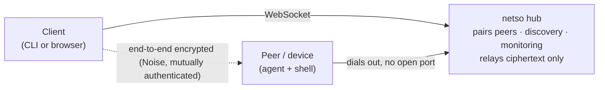

# netso

**Connect your machines and devices into private networks and get a secure shell
to any of them — from a terminal or a browser — without opening a single port.**

[](https://github.com/trustsentinel/netso/actions/workflows/ci.yml)
`Go` · self-hostable · part of [TrustSentinel](https://trustsentinel.eu)

netso is a self-hostable control plane for secure peer networks — think Tailscale
or Teleport, but with self-sovereign device identity (DIDs) and a browser shell
built in. A **hub** coordinates the peers; every session is **end-to-end
encrypted**, and the hub only ever relays ciphertext.

## How it works



- **Networks** group your peers and keep them isolated from one another.
- **Peers dial out** to the hub, so a device needs no open inbound port to reach.
- **You reach a peer by name** (`-peer web`) — never an IP address that might change.
- **The hub can't read your sessions** — encryption is end-to-end, peer to peer.
- **Identity is self-sovereign** — each device has a DID derived from its own key.

## Try it

The whole thing in Docker — a hub, two peers, and a client that opens a shell:
```bash
cd deploy/compose && docker compose build && docker compose run --rm e2e
```

From the command line:
```bash
netso-hub   -addr :8443                                    # run a hub
netso-agent -hub http://hub:8443 -network prod -name web   # join a device as "web"
netso peers -hub http://hub:8443 -network prod             # see what's on the network
netso ssh   -hub http://hub:8443 -network prod -peer web   # get a shell on it
```

In the browser: `make web && ./browser-demo.sh`, then open the printed URL, pick a
peer, and Connect.

On **Kubernetes**: `kubectl apply` a `Hub` and some `Peer` objects — an operator
turns them into a running platform ([guide](deploy/k8s/operator/)).

## Documentation
- **[Architecture](docs/architecture.md)** — components, the encryption model, discovery, deployment, and the roadmap.
- **[Identity (SSI / DIDs)](docs/identity.md)** — self-sovereign device identity, anchored on a blockchain registry.
- **[Docker demo](deploy/compose/)** · **[Kubernetes operator](deploy/k8s/operator/)** · **[Browser client](web/)**

## Layout
`cmd/` the binaries (`netso-hub`, `netso-agent`, `netso` CLI, `netso-wasm` browser
client) · `internal/` the pieces (`secure` Noise + identity, `transport`,
`registry`, `audit`, `did`, `shell`) · `deploy/` Docker + Kubernetes · `operator/`
the Kubernetes controller.

## Status
Working today: hub + agents, CLI **and** browser access, discovery, monitoring,
the SSI/DID identity core, and a Kubernetes operator — all unit-tested with a CI
pipeline and end-to-end demos. Later phases (the blockchain DID anchor, group
encryption, federated hubs, an IoT agent) are in the
[architecture doc](docs/architecture.md).

## Recognition
INCIBE National Cybersecurity Competition **2020 — Top 10**: a secure decentralized
platform built on self-sovereign identity and end-to-end encryption.

## TrustSentinel
Part of [TrustSentinel](https://trustsentinel.eu) — secure connectivity and
network-intelligence tooling by Álvaro López.

- **[netso](https://github.com/trustsentinel/netso)** — secure-networking platform (SSI + end-to-end encryption)  ·  _this repo_
- **[stk](https://github.com/trustsentinel/stk)** — browser-based remote shell broker
- **[stuk](https://github.com/trustsentinel/stuk)** — SSH access gating (port-knock + MFA)
- **[argos](https://github.com/trustsentinel/argos)** — P2P blockchain network scanning
- **[eth-rlp](https://github.com/trustsentinel/eth-rlp)** — RLP codec for Ethereum discv4

## License
MIT — see [LICENSE](LICENSE).
